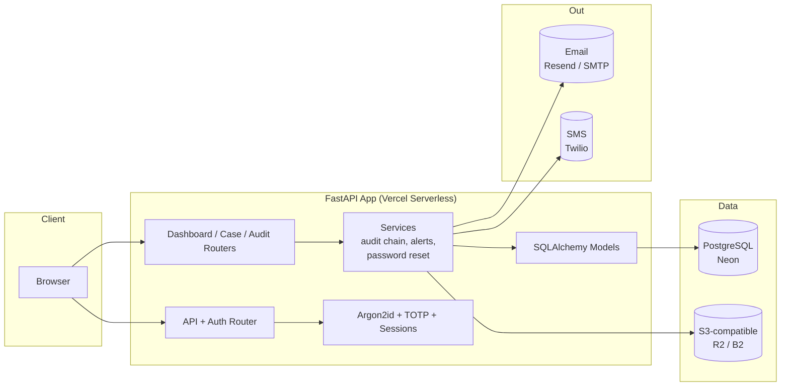

<p align="center">
  
</p>

<p align="center">
  <b>Secure Digital Evidence Locker</b><br>
  A tamper-evident case &amp; evidence management platform with cryptographic audit trails,
  two-factor authentication, login alerts, and role-based access control.
</p>

<p align="center">
  <a href="https://github.com/k-shopnil/evidentia/blob/main/LICENSE">
    
  </a>
  
  
  
  
  
  
</p>

<p align="center">
  
  
  
  
  
  
</p>

> Live demo: **[https://evidentia-khaki.vercel.app](https://evidentia-khaki.vercel.app)** — the first account registered
> in any fresh instance becomes the **admin**; every account after that is an **officer**.

---

## Table of Contents

- [Features](#features)
- [Architecture](#architecture)
- [Security & Integrity](#security--integrity)
- [Supervisor Requirements — Where Each One Lives](#supervisor-requirements--where-each-one-lives)
- [Getting Started](#getting-started)
- [Environment Variables](#environment-variables)
- [Demo Mode](#demo-mode)
- [Login Alerts](#login-alerts)
- [Deployment](#deployment)
- [Testing](#testing)
- [Project Structure](#project-structure)
- [API Routes](#api-routes)
- [License](#license)

---

## Features

### Case Management
- Create, open, and **close cases** with structured metadata (title, case ID, priority, status).
- Attach **multiple pieces of evidence** per case (PDF, images, text — MIME-whitelisted, 100 MB cap).
- Evidence uploads are stored in **S3-compatible object storage** (Cloudflare R2 / Backblaze B2) with presigned download URLs.

### Integrity & Trust
- Every recorded action is appended to a **SHA-256 hash chain** — each audit record carries the hash of the previous one. Any tampering breaks the chain and is immediately detectable.
- Evidence files are **hash-verified on download** (`Integrity Verified` / `Integrity Compromised`), so corrupted or swapped files are caught.
- Hash-only evidence fingerprints are stored on the database — raw files live in object storage, unused capacity stays local on demand.

### Access Control
- **First registered user becomes admin**; subsequent users are officers.
- Role-based UI (admin panel for user management and unlocking) vs. officer workflow.
- **Account lockout** after 5 failed attempts (15 min) — admins can unlock accounts manually.
- Per-route **rate limiting** (login, register, general) with SlowAPI.

### Authentication
- **TOTP two-factor authentication** (authenticator-app style) with QR enrollment on first login.
- **Argon2id** password hashing.
- **Forgot-password flow** — one-time, hashed, 60-minute-expiring reset tokens, enumeration-safe responses, rate-limited, fully audited.
- Signed, HttpOnly session cookies (Secure flag in production).
- **Show/hide password toggles** (via eye icons) on login, register, and reset forms.
- A clean, dark "operational console" UI: near-black surfaces with a volt `#F8FF20` accent, Space Grotesk typography, status-dot indicators, and mono type for hashes/codes.

### Alerts & Notifications
- **New-device login alerts** — first sign-in from an unrecognized device fingerprints sends a branded email alert (SMS via Twilio when configured and a phone number is on file).
- Branded, dark-theme HTML emails for login alerts and password reset.
- Password reset **audit trail**: `PASSWORD_RESET_REQUESTED` / `PASSWORD_RESET_COMPLETED` / `PASSWORD_RESET_EMAIL_FAILED`.

### Demo Mode
- `DEMO_MODE=true` exposes safe, destructive-but-reversible controls: **Reset Demo Data**, **Simulate Evidence Tamper**, **Verify Chain** — perfect for showcasing integrity detection without real data risk.

---

## Architecture



**Request flow (upload path):** browser uploads evidence -> API validates MIME/size + CSRF + auth -> file streamed to object storage -> SHA-256 computed server-side -> fingerprint + metadata stored in PostgreSQL -> audit record appended to the hash chain.

---

## Security & Integrity

### Jargon, unpacked

| Term | Plain meaning |
| --- | --- |
| **Argon2id** | A modern *password-hashing* algorithm — deliberately slow and memory-hungry, so even if the database file leaks, brute-forcing the stored hashes is impractical. |
| **TOTP** | *Time-based One-Time Password* — the 6-digit code from your authenticator app (Google Authenticator, etc.). It changes every 30 seconds, so a stolen code is useless within a minute. |
| **SHA-256 hash** | A fixed-length "digital fingerprint" of any data. Same input always produces the same output; a single changed byte produces a completely different fingerprint. |
| **Hash chain** | Every audit record contains `sha256(previous record's hash + this record)`. Alter any record and every hash after it stops matching — tampering is mathematically provable. |
| **CSRF** | *Cross-Site Request Forgery* — a malicious website tricking your logged-in browser into performing actions (e.g. creating a case) on your behalf. Blocked by requiring a token that only your session knows. |
| **SQL injection** | Tricking an app into running attacker-written SQL by smuggling it inside a form field. Blocked by never building SQL strings by hand — the ORM always binds values as parameters. |
| **XSS** | *Cross-Site Scripting* — injecting malicious JavaScript that runs in another user's browser (e.g. via a case title). Blocked by escaping every dynamic value on render. |
| **Enumeration-safe** | An attacker cannot tell (from error messages or response timing) whether an email/username exists in the system. Failed logins and password-reset requests return identical outcomes. |
| **Presigned URL** | A short-lived, signed download link (5-minute expiry) — the raw evidence files are never exposed through unsignable public URLs. |
| **Signed session cookie** | The session is *cryptographically signed* with the server secret — anybody can read it, but nobody can forge or modify it. |

### What is protected, where

| Layer | Mechanism | File |
| --- | --- | --- |
| Passwords | Argon2id (time-cost 3, 64 MB memory) | `app/security/password.py` |
| Sessions | Signed cookie (itsdangerous), HttpOnly + Secure + SameSite, 60-min expiry | `app/security/auth.py` |
| CSRF | Per-session signed token on every POST form | `app/security/csrf.py` |
| 2FA | TOTP with QR enrollment (`pyotp`), required at login | `app/security/totp.py` + `app/routers/auth.py` |
| Brute force | 5-failed-attempt lockout (15 min) + rate limits on login/register/reset | `app/security/auth.py`, `app/config.py` |
| Reset tokens | 256-bit random, stored **hashed** (SHA-256), single-use, 60-min TTL | `app/services/password_reset.py` |
| Integrity | SHA-256 hash chain over every audit record; verifiable end-to-end | `app/services/audit.py` |
| Evidence | SHA-256 fingerprints + re-verification on download | `app/services/storage.py` |
| SQL injection | SQLAlchemy parameterized queries only — no raw SQL strings | all `db.query(...)` call sites |
| XSS | Jinja2 auto-escaping on every template variable | `app/templating.py` |
| Uploads | MIME whitelist + 100 MB cap + size/MIME rejects | `app/config.py`, `app/routers/evidence.py` |
| Access | Role checks (`admin` vs `officer`) enforced server-side on every route | `app/security/auth.py` (`require_admin`) |
| Errors | Enumeration-safe login and password-recovery responses | `app/routers/auth.py` |

---

## Supervisor Requirements — Where Each One Lives

Every requirement from the brief is implemented, tested, and easy to point at during a walkthrough.

### 1. Username & password login
`app/routers/auth.py` (`/login`), `app/security/auth.py` (`verify_credentials`), template `app/templates/auth/login.html`.
Passwords are checked against the stored Argon2id hash; the session only reaches "authenticated" after the full pipeline (password -> 2FA -> device check) completes.

### 2. Two-factor authentication (2FA)
`app/security/totp.py` + `app/routers/auth.py` (`/verify-2fa`).
On first login the user scans a **QR code** into any authenticator app (Google Authenticator, Authy, Aegis, ...). Every subsequent login requires a fresh 30-second TOTP code; the login state machine (`PASSWORD_VERIFIED -> 2FA_REQUIRED -> AUTHENTICATED`) prevents skipping the step:

```python
# app/security/totp.py
def verify_totp(secret: str, code: str, valid_window: int = 1) -> bool:
    totp = pyotp.TOTP(secret)
    return totp.verify(code, valid_window=valid_window)
```

### 3. Password hashing
`app/security/password.py` — **Argon2id** with deliberate cost parameters. Raw passwords never touch the database or the logs:

```python
# app/security/password.py
ph = PasswordHasher(
    time_cost=3,        # iterations
    memory_cost=65536,  # 64 MB of memory per hash
    parallelism=4,
    hash_len=32,
    salt_len=16,
)

def hash_password(password: str) -> str:
    return ph.hash(password)      # e.g. $argon2id$v=19$m=65536,t=3,p=4$...

def verify_password(password: str, password_hash: str) -> bool:
    try:
        ph.verify(password_hash, password)
        return True
    except VerifyMismatchError:
        return False
```

### 4. Lockout timeout after multiple failed attempts
`app/security/auth.py` (`increment_failed_attempts`), configured in `app/config.py` — **`LOCKOUT_MAX_ATTEMPTS=5`** and **`LOCKOUT_DURATION_MINUTES=15`** (set to `3` via environment variable if the brief demands 3). The counter is only reset by a successful login; admins can unlock accounts from the admin panel:

```python
# app/security/auth.py
def increment_failed_attempts(user_id: int):
    with get_db_context() as db:
        user = db.query(User).filter(User.id == user_id).first()
        if not user:
            return
        user.failed_attempts += 1
        if user.failed_attempts >= settings.LOCKOUT_MAX_ATTEMPTS:
            from datetime import timedelta
            user.locked_until = utcnow() + timedelta(minutes=settings.LOCKOUT_DURATION_MINUTES)
        db.commit()
```

While locked, `verify_credentials` refuses the login, and the UI reports the remaining minutes. Every failure and lockout is appended to the audit chain.

### 5. Password recovery
`app/services/password_reset.py` — full flowchart: user clicks *Forgot password?* -> generic "Check your inbox" response (no user enumeration) -> email carries a single-use link -> the token is stored **only as a SHA-256 hash** with a 60-minute expiry; reuse, expiry, and random-token attempts are all rejected; completing the reset invalidates every other outstanding token for that account:

```python
# app/services/password_reset.py
def _hash_token(token: str) -> str:
    return hashlib.sha256(token.encode("utf-8")).hexdigest()

# stored: PasswordResetToken(token_hash=..., expires_at=now + 60min)
```

### 6. Minimum password length
Enforced twice — client-side (`minlength="12"` on the form inputs) and server-side in both `register` and `reset-password`:

```python
# app/routers/auth.py
if len(password) < 12:
    return templates.TemplateResponse("auth/register.html", {
        "request": request,
        "error": "Password must be at least 12 characters",
        "csrf_token": get_csrf_token_for_session(request),
    })
```

### 7. New-device login notification (email / SMS)
`app/services/alerts.py` — on every login, the device's browser fingerprint + IP is compared with known devices. An unrecognized device raises `SECURITY_ALERT_NEW_DEVICE`: **SMS first** (Twilio) when the account has a phone number and Twilio is configured, **email otherwise** (branded Evidentia HTML via SMTP). Delivery status and failure reasons are stored on the audit chain and shown in the dashboard's Security Alerts panel:

```python
# app/services/alerts.py
if user.phone and settings.TWILIO_ACCOUNT_SID:
    channel = "sms"
    delivered = send_sms(user.phone, message)
    if not delivered:
        reason = "sms_delivery_failed"

if not delivered:
    channel = "email"
    delivered = send_new_device_alert(user.email, user.username,
                                      device_name, device_id, timestamp, ip)
    if not delivered:
        reason = "smtp_not_configured"
```

### 8. Protection against SQL injection
The entire data layer uses **SQLAlchemy with parameter-bound values** — no user input is ever string-concatenated into SQL, so injection payloads are treated as data, not code:

```python
# app/security/auth.py
user = db.query(User).filter(User.username == username).first()
# "username" is bound as a parameter, never interpolated into the query string
```

### 9. Protection against XSS
Templates use **Jinja2 with auto-escaping enabled** — every dynamic value (`{{ error }}`, `{{ case.title }}`, ...) is HTML-escaped on render, so a hostile value can never execute as script in another user's browser:

```html
<!-- app/templates/auth/reset_password.html -->

<div class="alert alert-danger">{{ error }}</div>

```

### 10. Protection against CSRF
Every mutating form embeds a signed, session-bound token; the server rejects POSTs without a valid match (`app/security/csrf.py`). Tokens are time-limited and bound to the session ID, so a forged cross-site request cannot obtain one:

```python
# app/security/csrf.py
def generate_token(self, session_id: str) -> str:
    data = {"session_id": session_id, "nonce": secrets.token_hex(16)}
    return self.serializer.dumps(data)

def validate_token(self, token: str, session_id: str) -> bool:
    try:
        data = self.serializer.loads(token, max_age=self.max_age)
        return data.get("session_id") == session_id
    except (BadSignature, SignatureExpired, Exception):
        return False
```

### Additional measures (not strictly required — built anyway)

| Measure | Why it matters | File |
| --- | --- | --- |
| **SHA-256 audit hash chain** | Every action is chained to its predecessor — retroactive tampering is detectable record-by-record | `app/services/audit.py` |
| **Signed session cookies** | Sessions can't be forged or modified (itsdangerous + server secret) | `app/security/auth.py` |
| **Cookie hardening** | HttpOnly (JS can't read), Secure (HTTPS-only), SameSite=Lax | `app/security/auth.py` |
| **Rate limiting** | SlowAPI caps login (5/min), register (3/min), intel (10/min), reset flows (3/min) | `app/security/rate_limit.py` |
| **Enumeration-safe responses** | Identical messages for unknown user vs wrong password, unknown email vs sent reset link | `app/routers/auth.py` |
| **Evidence integrity re-check** | Files are hashed again on download — swapped/corrupted evidence is flagged `Integrity Compromised` | `app/services/storage.py` |
| **Presigned download URLs** | Object-storage links expire after 5 minutes | `app/services/storage.py` |
| **Reset tokens hashed at rest** | A DB leak exposes no usable reset links — only their SHA-256 hashes | `app/services/password_reset.py` |
| **Role-based access control** | `require_admin()` blocks officer access on admin routes server-side | `app/security/auth.py` |
| **MIME whitelist + size cap** | Uploads restricted to pdf/jpeg/png/gif/txt, 100 MB max | `app/config.py` |
| **Demo tamper/verify** | Simulate an attack and watch the hash chain expose it | `app/routers/cases.py`, `app/services/audit.py` |

---

## Getting Started

```bash
git clone https://github.com/k-shopnil/evidentia.git
cd evidentia
python -m venv .venv
# Windows: .venv\Scripts\activate    macOS/Linux: source .venv/bin/activate
pip install -r requirements.txt
cp .env.example .env
uvicorn app.main:app --reload
```

Open **http://localhost:8000**, register the first account — it becomes the **admin** immediately.

> Local development defaults to SQLite + local disk storage for evidence — zero extra services required to start building.

---

## Environment Variables

| Variable | Default | Purpose |
| --- | --- | --- |
| `SECRET_KEY` | dev-only | Signs session cookies — required in production |
| `DATABASE_URL` | `sqlite:///./evidentia.db` | SQLAlchemy connection string (`postgresql+psycopg://...` in production) |
| `DEBUG` | `true` | Dev mode (templates, stack traces) |
| `SESSION_COOKIE_SECURE` | `false` | Force `true` behind HTTPS |
| `DEMO_MODE` | `false` | Enables demo controls (reset / tamper / verify) |
| `STORAGE_BACKEND` | `auto` | `local` or `s3` (auto-detected when R2 vars are present) |
| `R2_ENDPOINT_URL` | — | S3-compatible endpoint (R2 / B2) |
| `R2_ACCESS_KEY_ID` / `R2_SECRET_ACCESS_KEY` | — | Object storage credentials |
| `R2_BUCKET` | — | Storage bucket name |
| `EVIDENCE_STORAGE_PATH` | `./app/storage/evidence` | Local backend directory |
| `MAX_FILE_SIZE_MB` | `100` | Upload cap |
| `ALLOWED_MIME_TYPES` | pdf, jpeg, png, gif, txt | Upload whitelist |
| `LOCKOUT_MAX_ATTEMPTS` | `5` | Failed logins before lockout |
| `LOCKOUT_DURATION_MINUTES` | `15` | Lockout window |
| `RATE_LIMIT_LOGIN` | `5/minute` | Login rate cap |
| `RATE_LIMIT_REGISTER` | `3/minute` | Registration rate cap |
| `SMTP_HOST` / `SMTP_PORT` / `SMTP_USERNAME` / `SMTP_PASSWORD` / `SMTP_FROM` | — | Email delivery (e.g. Resend free SMTP) |
| `TWILIO_ACCOUNT_SID` / `TWILIO_AUTH_TOKEN` / `TWILIO_FROM_NUMBER` | — | Optional SMS login alerts |

---

## Demo Mode

With `DEMO_MODE=true`, an **admin-only** control panel appears on the dashboard:

| Control | What it does |
| --- | --- |
| **Reset Demo Data** | Rebuilds the demo case + evidence (keeps only the acting admin account), reseeds a clean audit chain |
| **Simulate Evidence Tamper** | Swaps a byte in a stored evidence file — integrity reports flip to `Integrity Compromised` |
| **Simulate Audit Tamper** | Edits an audit record — the chain verification reports exactly where the tampering was detected |
| **Verify Chain** | Runs the full audit-chain verification and shows the verdict |

This is the fastest way to see tamper detection in action without touching real data.

---

## Login Alerts

When a user signs in from a device the platform has never seen before (browser fingerprint + IP), it records a `SECURITY_ALERT_NEW_DEVICE` audit entry and notifies the account holder:

- **Email** — branded Evidentia HTML template via SMTP (Resend free tier works out of the box).
- **SMS** — via Twilio, used when `TWILIO_*` variables are set **and** the account has a phone number.

The dashboard shows a **Security Alerts panel** for the signed-in user: time, device, channel, and delivery status (`delivered` / reason it was not sent).

---

## Deployment

The app ships as a single serverless entrypoint (`api/index.py` -> `app.main`) with `vercel.json` routing all traffic to it.

**Recommended stack (all free tiers):**

1. **Hosting** — Vercel: `vercel deploy --prod --yes`
2. **Database** — Neon (PostgreSQL): set `DATABASE_URL`, the schema auto-initializes on first cold start.
3. **Storage** — Cloudflare R2 or Backblaze B2 (S3 API): set `STORAGE_BACKEND=s3` + the five `R2_*` variables.
4. **Email** — Resend free SMTP: set the `SMTP_*` variables (smtp.resend.com:587).
5. **SMS (optional)** — Twilio trial: set the `TWILIO_*` variables.

> The first cold start runs `init_db()` — it creates tables and `ALTER TABLE`-style `_ensure_column` migrations automatically; no manual DDL needed.

---

## Testing

The test suites are self-contained scripts (each spins up its own SQLite DB and cleans nothing — run from the repo root):

```bash
python test_demo_mode.py        # demo lifecycle: first-user admin, seed, tamper+verify, officer lockout/unlock
python test_audit_chain.py      # chain construction, tamper simulation, hash-chaining verification
python test_cases_evidence.py   # case CRUD, evidence upload/download/verify, permissions
```

Covered: first-registered-user-becomes-admin, demo reset (no fake accounts), chain validity after seed, evidence tamper -> `Integrity Compromised` -> restore -> `Integrity Verified`, audit tamper detection with record-level detail, admin unlocks, plus login/2FA/lockout flows and the full password-reset lifecycle (token hashing, single-use enforcement, enumeration resistance, audit trail).

---

## Project Structure

```
evidentia/
├── api/
│   └── index.py                # Vercel serverless entrypoint (mangum)
├── app/
│   ├── main.py                 # FastAPI app, session/CSRF/rate-limit middleware
│   ├── config.py               # Environment-driven settings
│   ├── database.py             # Engine, session factory, init_db + column migrations
│   ├── models.py               # User, Case, Evidence, AuditLog, PasswordResetToken
│   ├── routers/
│   │   ├── auth.py             # login, register, 2FA, logout, password reset
│   │   ├── dashboard.py        # overview + security alerts + demo controls
│   │   ├── cases.py            # case + evidence CRUD, downloads, close case
│   │   ├── audit.py            # audit log page + chain verification
│   │   └── admin.py            # user management, role change, unlock
│   ├── services/
│   │   ├── audit.py            # SHA-256 hash-chain ledger + verification
│   │   ├── email.py            # SMTP dispatch, branded HTML templates
│   │   ├── alerts.py           # new-device detection + notification orchestration
│   │   ├── password_reset.py   # request/complete/validate reset tokens
│   │   └── storage.py          # local + S3 backends, presigned URLs, hashing
│   ├── security/
│   │   ├── auth.py             # session management, device fingerprinting
│   │   └── password.py         # Argon2id hash/verify
│   ├── static/
│   │   ├── css/style.css       # full dark "console" design system
│   │   └── js/password-toggle.js
│   └── templates/              # Jinja2 auth / dashboard / cases / audit / admin
├── test_*.py                   # end-to-end suites (see Testing)
├── vercel.json                 # serverless routing
└── .env.example
```

---

## API Routes

| Method | Path | Purpose |
| --- | --- | --- |
| GET/POST | `/register` | Create account (first user = admin) |
| GET/POST | `/login` | Sign in (+ new-device alert) |
| GET/POST | `/verify-2fa` | TOTP enrollment & verification |
| GET/POST | `/forgot-password` | Request reset email (enumeration-safe) |
| GET/POST | `/reset-password` | Redeem one-time reset token (CSRF + length enforced) |
| GET | `/dashboard` | Overview, recent cases, security alerts, demo panel |
| GET/POST | `/cases` | List / create cases |
| GET/POST | `/cases/{id}` | Detail + evidence upload |
| GET | `/cases/{id}/evidence/{eid}/download` | Download with integrity check |
| POST | `/cases/{id}/close` | Close a case |
| GET | `/audit` | Audit log with chain verification |
| GET | `/admin/users` | User management (admin only) |
| POST | `/logout` | End session |

---

## License

[MIT](/LICENSE) — free to use, study, change, and redistribute. Built with FastAPI, SQLAlchemy, Bootstrap, and a lot of argon.